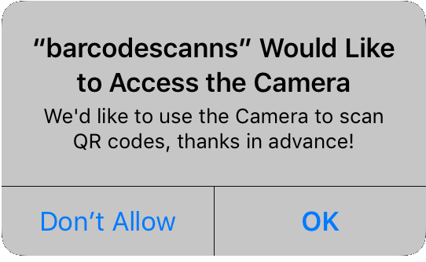

# NativeScript BarcodeScanner

Scan a barcode (or a QR code, or a lot of other formats really)

## Supported barcode types

### iOS and Android
* CODE_39
* CODE_93
* CODE_128
* EAN_8
* EAN_13
* QR_CODE
* UPC_E
* AZTEC (on Android only when passed in explicity via `formats`)
* PDF_417 (on Android only when passed in explicity via `formats`)

### Android only
* DATA_MATRIX
* CODABAR
* MAXICODE
* ITF
* RSS_14
* UPC_A

## Installation
From the command prompt go to your app's root folder and execute:
```
tns plugin add nativescript-barcodescanner
```

## iOS runtime permission reason
You've probably seen a permission popup like this before (this plugin will trigger one as well, automatically):



iOS 10+ requires not only this popup, but also a _reason_. In this case it's "We'd like to use the Camera ..".

You can provide your own reason for accessing the camera by adding something like this to `app/App_Resources/ios/Info.plist`:

```xml
  <key>NSCameraUsageDescription</key>
  <string>My reason justifying fooling around with your camera</string>
```

_To not crash your app in case you forgot to provide the reason this plugin adds an empty reason to the `.plist` during build. This value gets overridden by anything you specified yourself. You're welcome._

## Usage

### function: scan
```js
  var barcodescanner = require("nativescript-barcodescanner");

  barcodescanner.scan({
    formats: "QR_CODE,PDF_417",   // Pass in of you want to restrict scanning to certain types
    cancelLabel: "Stop scanning", // iOS only, default 'Close'
    message: "Go scan something", // Android only, default is 'Place a barcode inside the viewfinder rectangle to scan it.'
    preferFrontCamera: false,     // Android only, default false
    showFlipCameraButton: true,   // Android only, default false (on iOS it's always available)
    orientation: "landscape"      // Android only, optionally lock the orientation to either "portrait" or "landscape"
  }).then(
      function(result) {
        console.log("Scan format: " + result.format);
        console.log("Scan text:   " + result.text);
      },
      function(error) {
        console.log("No scan: " + error);
      }
  );
```

### function: available
Note that the Android implementation will always return `true` at the moment.
```js
  var barcodescanner = require("nativescript-barcodescanner");

  barcodescanner.available().then(
      function(avail) {
        console.log("Available? " + avail);
      }
  );
```

### function: hasCameraPermission / requestCameraPermission
On Android 6 you need to request permission to use the camera at runtime when targeting API level 23+.
Even if the `uses-permission` tag for the Camera is present in `AndroidManifest.xml`.

Note that `hasCameraPermission` will return true when:
* You're running this on iOS, or
* You're targeting an API level lower than 23, or
* You're using Android < 6, or
* You've already granted permission.

```js
  barcodescanner.hasCameraPermission().then(
      function(granted) {
        // if this is 'false' you probably want to call 'requestCameraPermission' now
        console.log("Has Camera Permission? " + result);
      }
  );

  // if no permission was granted previously this wil open a user consent screen
  barcodescanner.requestCameraPermission().then(
      function() {
        console.log("Camera permission requested");
      }
  );
```

Note that the `scan` function will also check for permission and ask for it if it wasn't previously granted.
If you're relying on that, then you should know that since we're not catching the consent result
the user will then need to allow camera access and launch the scanner again.
