# Debugging NativeScript CLI app with the Hybrid (Java and CPP) debugger in Android Studio

## Prerequisites:
 - [Android Studio](https://developer.android.com/studio/index.html#downloads)
 - Android SDK (Can be managed through the SDK Manager in AS)
   - Android Platform 23, 24, 25
   - Android Support Repository
   - Build Tools *25.0.2*
 - Android NDK 12b - [NDK Archives](https://developer.android.com/ndk/downloads/older_releases.html)

## First Launch
 - Open Android Studio - Click `Open an existing Android Studio project`
 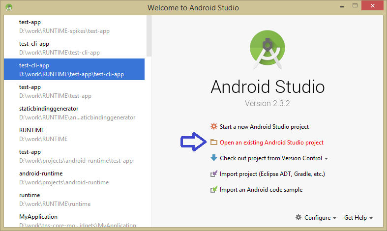
 - Select the `test-cli-app` Gradle project and click `OK`
 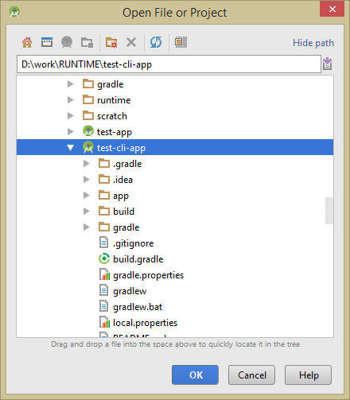
 - Next configure the path to the Android NDK. This allows compilation and debugging of the native code (the runtime contains predominantly C++ code). `File -> Project Structure...` (`Ctrl+Alt+Shift+S`)
 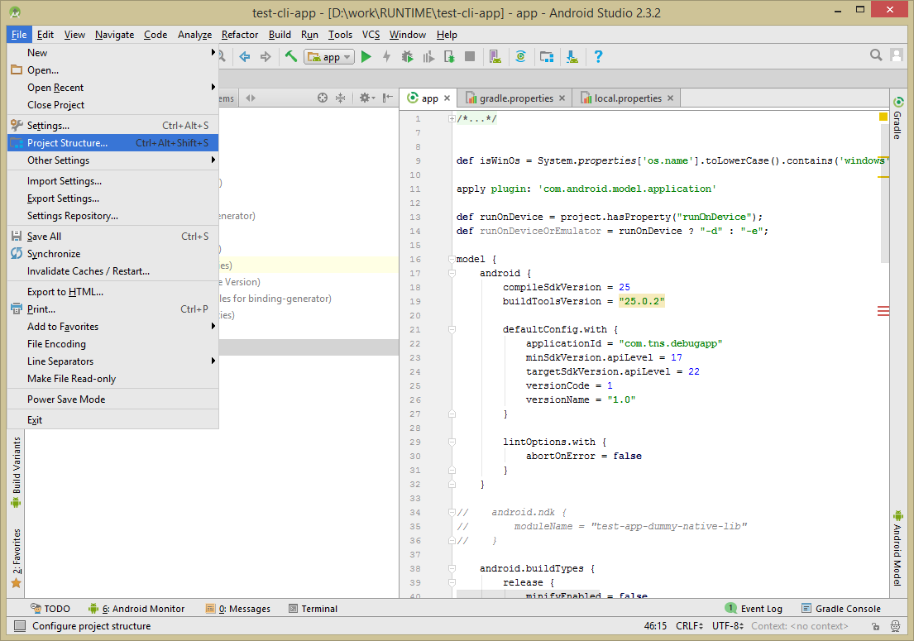
 - Set the Android NDK location to point to your `12b` extracted NDK package on a hard drive. If prompted - **Do not** install latest NDK.
 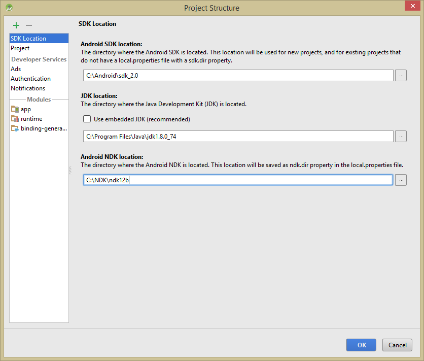

 ## Configuring the project
  - Build a NativeScript application using the CLI (`tns build android`)
  - Navigate to `my-app/platforms/android/`, copy the `src` directory to `test-cli-app/app/`
  - Align the `model.android.compileSdkVersion` to match the one used when building your project (default - highest installed, or one passed with the `--compileSdk` flag)
  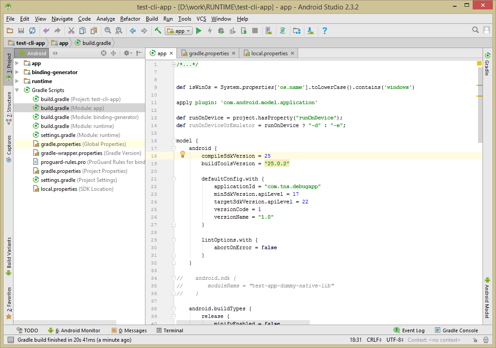
  - Align the support library versions so that the big version (first number) matches that of the compileSdk
  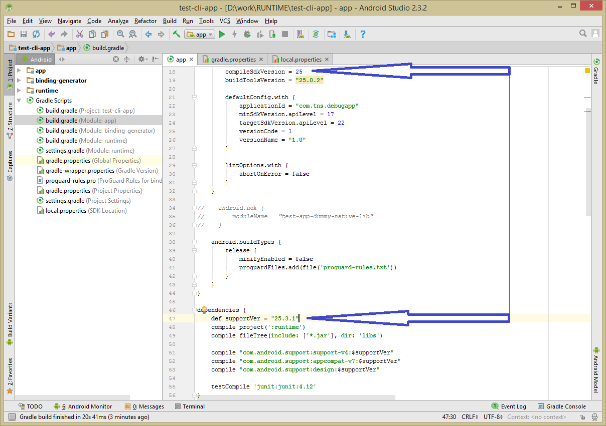
  - > **IMPORTANT**: If the project refers to any gradle plugins (additional support library plugins, sidedrawers, design library, google play libraries, 3rd party libraries etc.) either in `my-app/app/app.gradle`, or in any of the nativescript plugins installed in the application, those references will need to be included manually in the `test-cli-app/app/build.gradle` file's `dependencies` scope.

  - Illustration of the above: using the `nativescript-drawingpad` in a project, it is required to refer the jcenter `"com.github.gcacace:signature-pad"` package:
  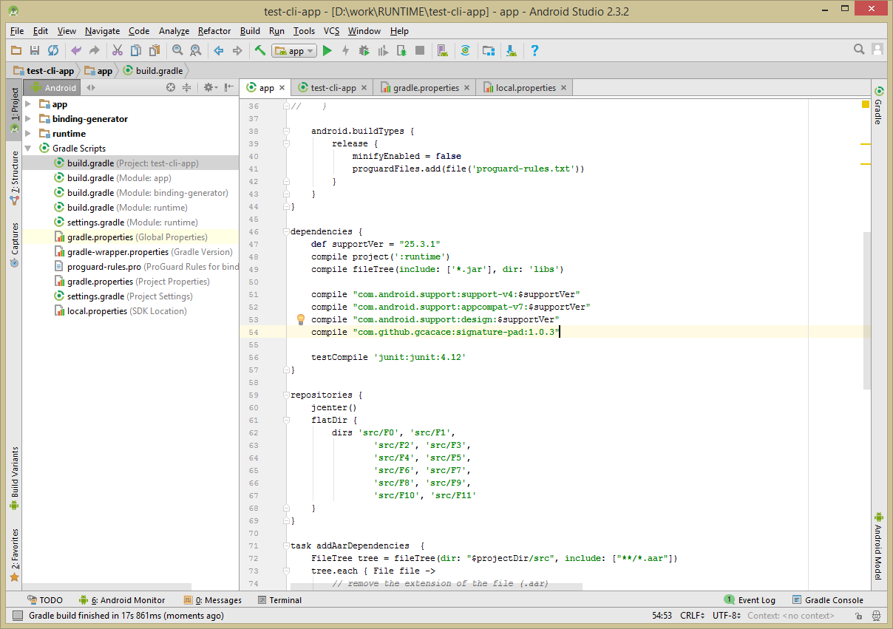
  - Build the entire project to ensure everything is setup properly, and the runtime is ready to be debugged - `Build -> Rebuild Project`
  

 ## Configuring debug symbols for debugging C++ code
- **Note:** The following needs to be done only once. The paths to the binary directories are stored locally. Add the necessary symbols that will allow your applications to break in native (C++) code
- Click on the `app` project -> `Edit Configurations`...
    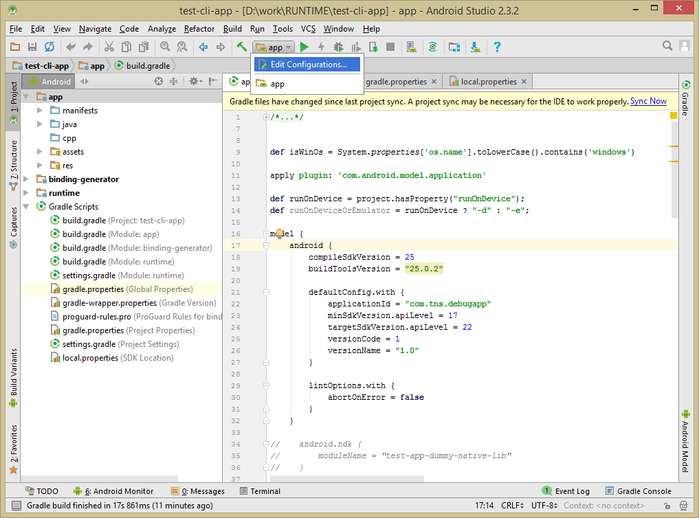
- On the settings window that opens up click on the `Debugger` tab
    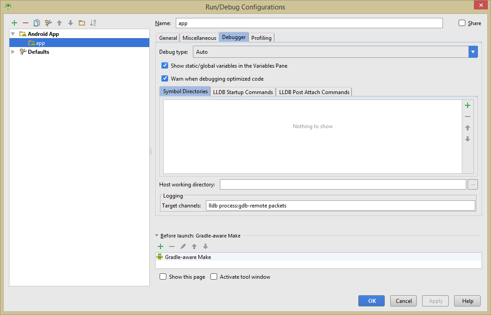
- Click the `+` (plus) button and proceed by adding the directories with the symbol tables for x86 and armeabi-v7a ABIs. This will ensure that whether the application debugged is an x86 emulator, or an armeabi-v7a device, C++ breakpoints will be hit.
    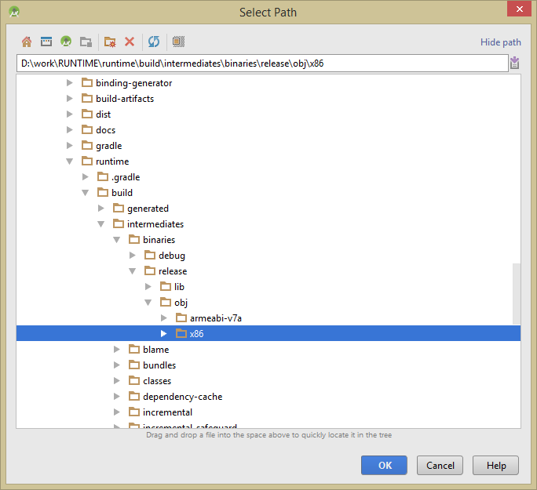
- Ultimately the `Debugger/Symbol Directories` tab should end up looking like this:
    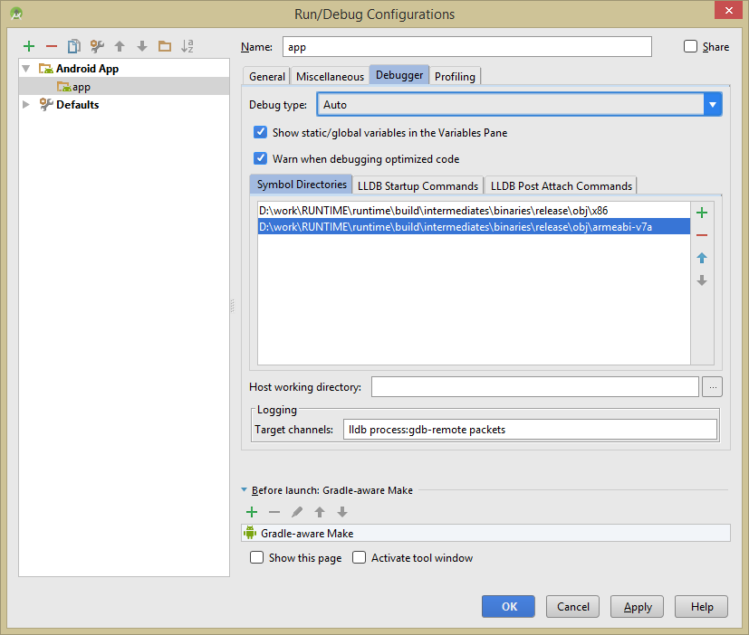

## Debugging the project
Click the Play/Debug icon beneath the Android Studio Toolbar to run yourNativeScript app using the locally built runtime. Any changes made to the`runtime` subproject will be reflected immediately on following installations(runs) of the app through the AS UI.

In addition to debugging of the runtime bits, AS provides a clean and usefulUI to monitor the device Logcat. (Alt-6) will open the `Android Monitor` tool.
